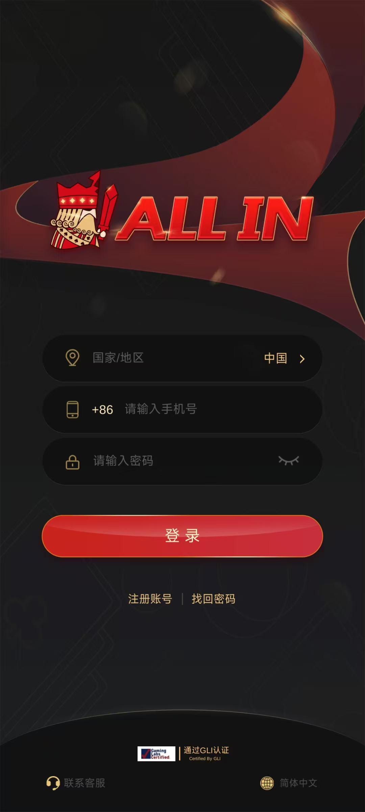
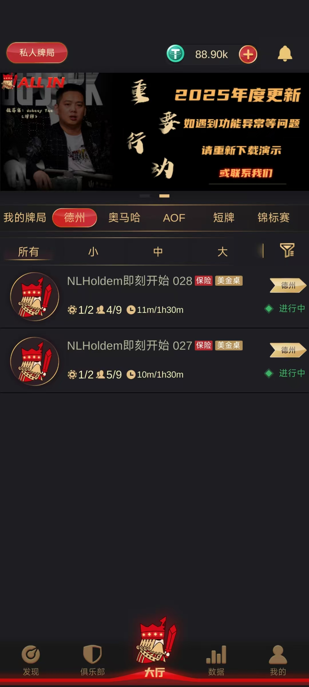
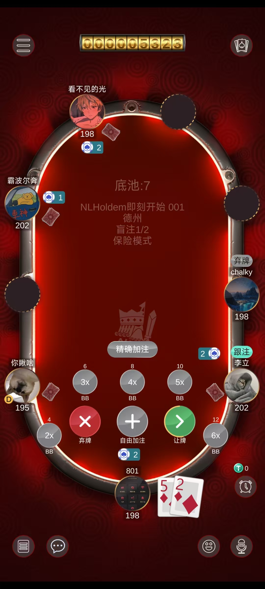
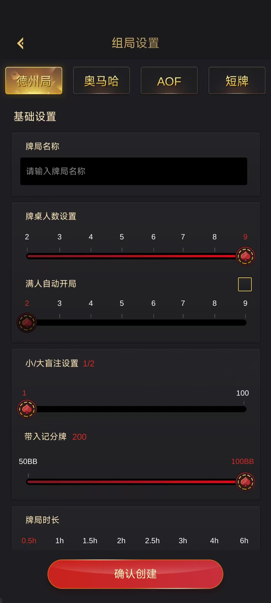
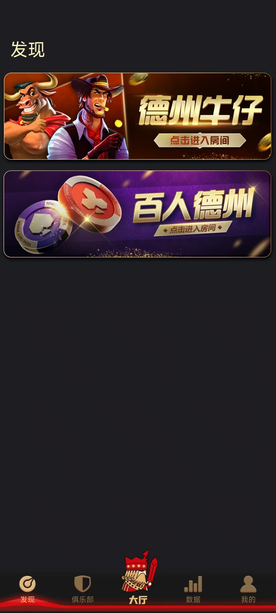
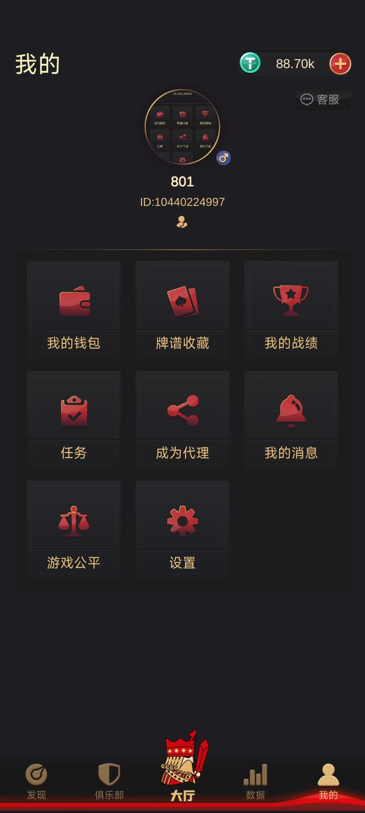
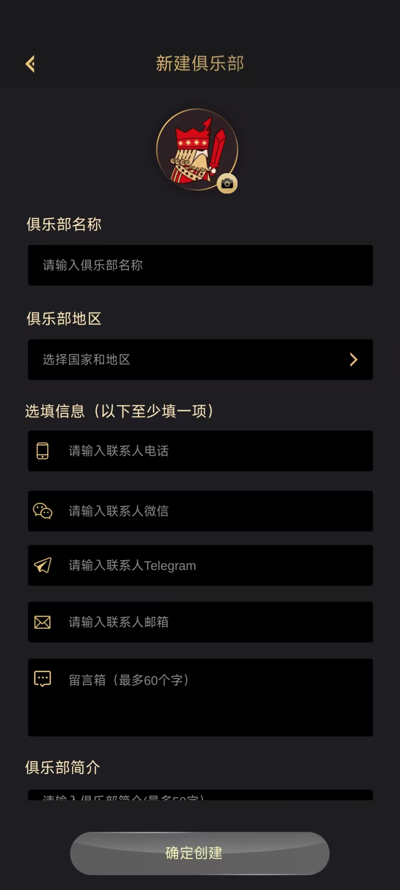
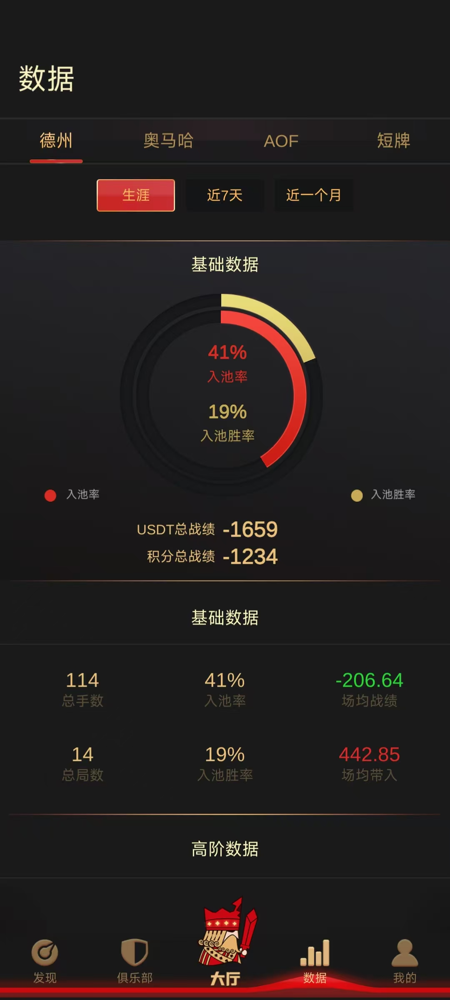

# 🃏 德州扑克源码 | 德州撲克原始碼 | Texas Hold'em Source Code

**开发数年 · 支持线下验证 ·ALLIN德州扑克源码**

**简体中文 · 繁體中文 · English· Tiếng Việt**

---

## 📖 产品简介 | 產品簡介 | Overview
- [Overview | 产品简介（多语言）](./docs/overview-multilingual.md)
🔥 Production-ready mobile poker platform (used in real projects)
🔥 移动端德州扑克平台，运营级系统，运营级德州扑克代码
🔥 联系获取完整源码和在线演示

## ✨ 核心功能 | Core Features
- [功能清单（Feature List）](./docs/feature-list.md)
## 🏗️ 技术架构 | Tech Stack
- [部署说明模板](./docs/deploy-sample.md)

| 模块 | 技术 |
|:---|:---|
| 客户端引擎 | Unity (C#) |
| 服务端语言 | JAVA |
| 网络框架 | 高性能分布式架构 |
| 数据库 | MySQL + Redis+mongdb |
| 支付接口 | 支付宝 / 微信 / USDT |
| 并发能力 | 单服支持数万在线 |

---
## ⚙️ Technical Highlights | 技术亮点 | 技術亮點
- [Technical Highlights | 技术亮点](./docs/technical-highlights.md)
- 
## 🧩 System Modules | 系统模块 | 系統模組
- [System Modules | 系统模块](./docs/system-modules.md)
## 📸 界面截图 | Screenshots
|:---:|:---:|:---:|

---

## 📞 获取完整源码 | How to Get

如需获取**德州扑克源码 + 部署文档 + 技术支持**，请联系：

| 渠道 | 账号 |
|:---|:---|
| **公司** | 苏州阳昇网络科技有限公司 |
| **QQ** | 923600105 |
| **Email** | 923600105@qq.com |
| **Telegram** | @tzgzs888 |
---

## ❓ 常见问题 | FAQ

**Q1：这套代码运营了多久？**  
A：已运营数年，是一款经过市场长期验证的成熟产品。

**Q2：支持多少人在线？**  
A：支持数万玩家同时在线，架构经过高并发考验。

**Q3：收入情况如何？**  
A：是一款高收入产品，可参考AAPOKER,具体数据可联系了解。

**Q4：支持哪些平台？**  
A：iOS、Android。

**Q5：可以二次开发吗？**  
A：可以。源码无加密，支持功能扩展和UI定制。

**Q6：提供部署服务吗？**  
A：提供。购买后协助部署,可以线下验证。

---

## License

Commercial Proprietary License: [查看许可协议](./LICENSE)

**如果这个项目对你有帮助，欢迎点个 Star 支持一下！**  
⭐️ **Star** ⭐️

